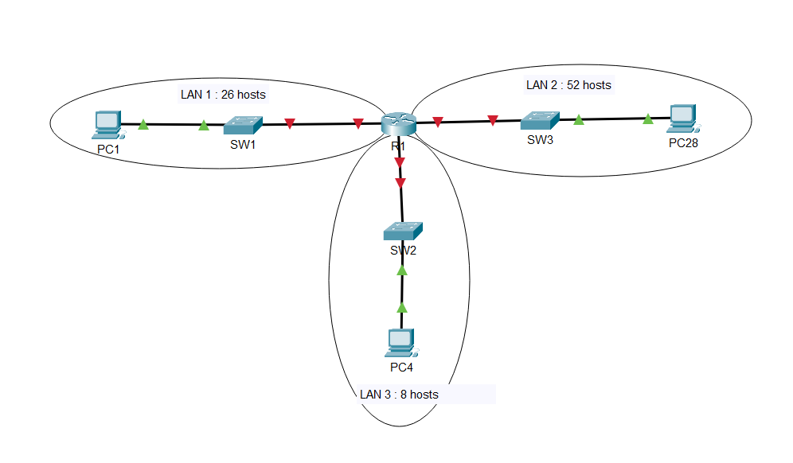

### CCNA - Network fundamentals : Configure VLSM on an IPv4 Network

_Topics: subnetting, VLSM_

#### Topology

#### Instructions :

1. From 192.168.100.0/24, create three subnets:

- LAN 1: 52 hosts
- LAN 2: 26 hosts
- LAN 3: 8 hosts

2. Assign the last usable IP of each subnet to the Router interface.

3. Assign IPs to PC1 (LAN 1), PC4 (LAN 3), and PC28 (LAN 2)

4. Test connectivity between all PCs.

---

#### Hint 1: Subnetting for LAN Servers (Question 1)

From the network 192.168.100.0/24, you need to create three subnets of different sizes using VLSM.

**VLSM Rule:** Always subnet from **largest to smallest** to avoid overlapping.

**Order:**

1. LAN 2 (52 hosts) - Largest
2. LAN 1 (26 hosts) - Medium
3. LAN 3 (8 hosts) - Smallest

**📺 Tutorial:** [VLSM Subnetting - Sunny Classroom](https://www.youtube.com/watch?v=RLCd5u0sjoU)

---

Lab Starter and Solution Files in :

**Download:** [GitHub Repository](https://github.com/dineproject/ccna-labs/networkfundamentals)
**Download:** [Google drive](https://drive.google.com/drive/u/1/folders/1u8mwEXy5HasH5t5agzvljvLu-BLnvoeF)

---
